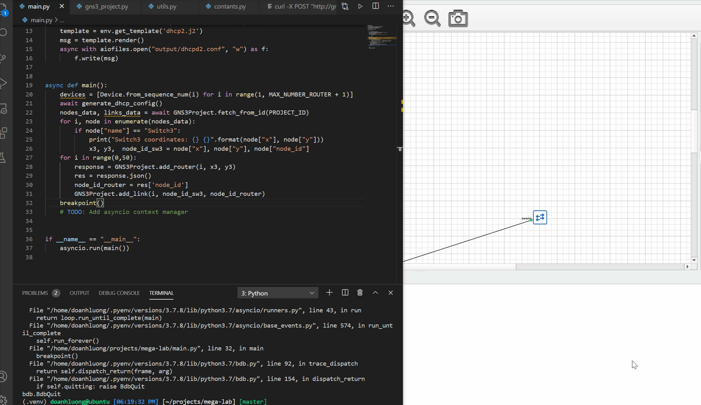
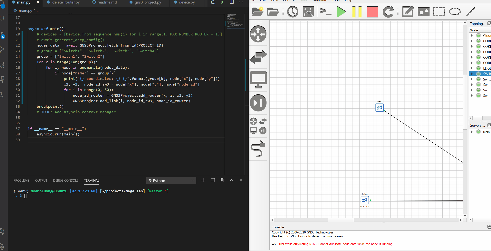

mega-lab app
## Using GNS3 API to add nodes and links to the network

## Zero Touch Provisioning
- Auto add and start routers.
 - Automatically assign IP addresses for routers when booted using DHCP server.

